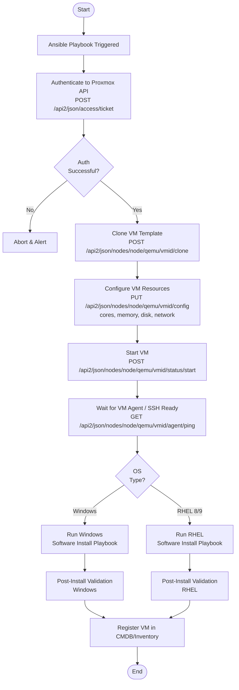
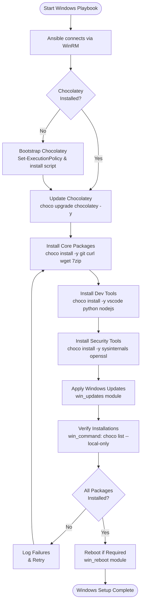
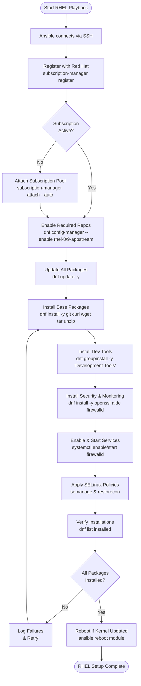
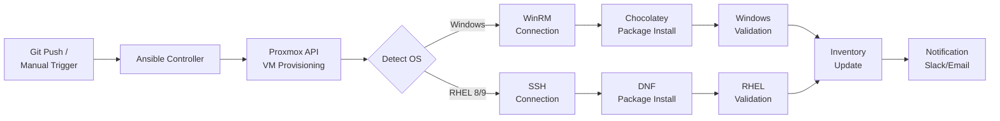

# DevOps
Development and Operations Automation

---

## Overview

This repository contains automation workflows for infrastructure provisioning and software deployment using **Ansible** and **Proxmox**, with automated builds via API and platform-specific package management.

---

## Technology Stack

| Component        | Tool/Platform              |
|------------------|----------------------------|
| Hypervisor       | Proxmox VE                 |
| Automation       | Ansible                    |
| Windows Packages | Chocolatey (choco)         |
| RHEL 8/9 Packages| DNF                        |
| API Integration  | Proxmox REST API           |

---

## Proxmox + Ansible Architecture

```
┌─────────────────────────────────────────────────────────────────┐
│                        CONTROL NODE                             │
│                    (Ansible Controller)                         │
└────────────────────────┬────────────────────────────────────────┘
                         │
                         ▼
┌─────────────────────────────────────────────────────────────────┐
│                     PROXMOX VE HOST                             │
│              REST API  (https://<host>:8006/api2/json)          │
└────────┬───────────────┬───────────────────┬────────────────────┘
         │               │                   │
         ▼               ▼                   ▼
    ┌─────────┐    ┌─────────┐         ┌─────────┐
    │  VM 1   │    │  VM 2   │   ...   │  VM N   │
    │ Windows │    │ RHEL 8/9│         │ RHEL 8/9│
    └─────────┘    └─────────┘         └─────────┘
```

---

## Build Flow via Proxmox API



---

## Windows Software Installation via Chocolatey



### Example Ansible Task — Windows (Chocolatey)

```yaml
- name: Install packages via Chocolatey
  chocolatey.chocolatey.win_chocolatey:
    name:
      - git
      - curl
      - wget
      - 7zip
      - vscode
      - python
      - nodejs
      - sysinternals
      - openssl
    state: present
  vars:
    ansible_connection: winrm
    ansible_winrm_transport: ntlm
```

---

## RHEL 8/9 Software Installation via DNF



### Example Ansible Task — RHEL 8/9 (DNF)

```yaml
- name: Install packages via DNF
  ansible.builtin.dnf:
    name:
      - git
      - curl
      - wget
      - tar
      - unzip
      - openssl
      - aide
      - firewalld
    state: present
    update_cache: true

- name: Install Development Tools group
  ansible.builtin.dnf:
    name: "@Development Tools"
    state: present

- name: Enable and start firewalld
  ansible.builtin.systemd:
    name: firewalld
    enabled: true
    state: started
```

---

## End-to-End Automation Flow



---

## Directory Structure

```
DevOps/
├── inventories/
│   ├── proxmox/          # Dynamic inventory from Proxmox API
│   ├── windows/          # Windows hosts
│   └── rhel/             # RHEL 8/9 hosts
├── playbooks/
│   ├── provision_vm.yml  # Proxmox VM creation via API
│   ├── windows_setup.yml # Chocolatey software install
│   └── rhel_setup.yml    # DNF software install
├── roles/
│   ├── proxmox_api/      # Proxmox API interaction role
│   ├── chocolatey/       # Windows package management role
│   └── dnf_packages/     # RHEL package management role
├── vars/
│   ├── windows_packages.yml
│   └── rhel_packages.yml
└── README.md
```

---

## Prerequisites

- Proxmox VE 7+ with API token configured
- Ansible 2.14+ on control node
- WinRM enabled on Windows targets
- SSH key-based auth on RHEL targets
- Red Hat subscription for RHEL package repos
